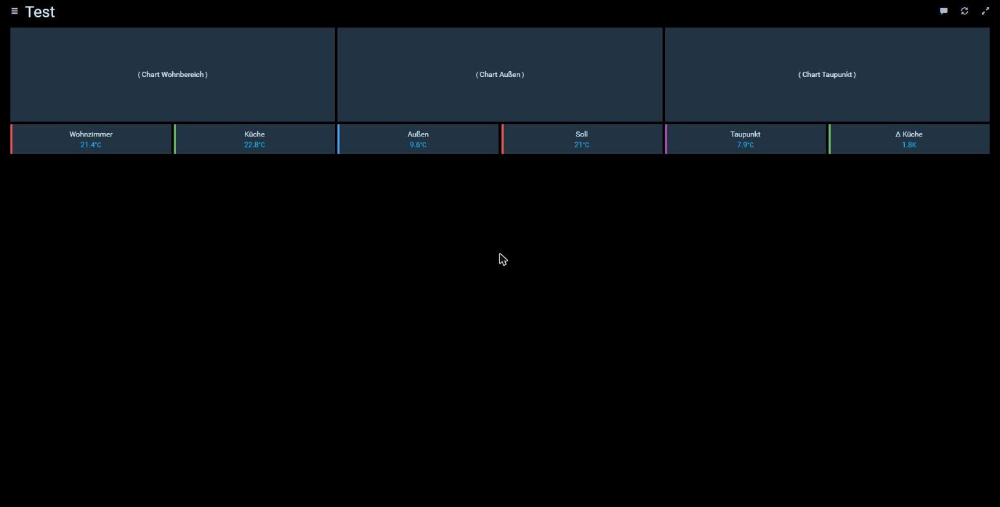
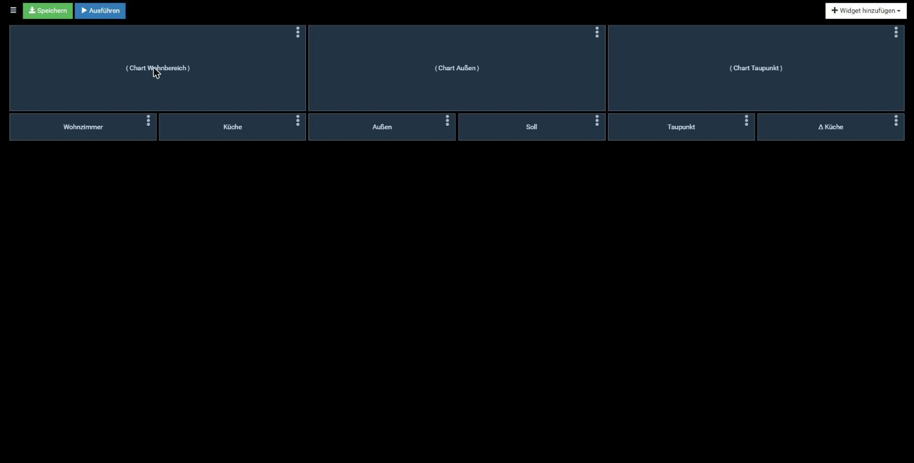

# Das Raster verstehen: Spalten, Zeilenhöhe, Anfasser

Drei Eigenheiten von HABPanel, die immer wieder für „das geht nicht" sorgen. Keine davon
ist ein Fehler, alle drei sind an einem Nachmittag nachgemessen worden.

## 1. Die Spaltenzahl entscheidet über Höhe *und* Breite

**Dashboard-Einstellungen → Erweitert → „Nb. of columns (default 12)"**

Ist das Feld leer, gilt **12**. Und weil `Row height (%)` leer bedeutet „quadratische
Zellen", ist eine Zeile dann **genauso hoch wie eine Spalte breit**.

Auf einem 2530 px breiten Bildschirm heißt das:

| Spalten | Schrittweite | kleinste Kachel |
|---|---|---|
| 12 (Standard) | 210 px | 210 × 210 px |
| 36 | 70 px | 70 × 70 px |
| 60 | 42 px | 42 × 42 px |

Daraus folgen die beiden häufigsten Beschwerden, und beide haben dieselbe Ursache:

- *„Ich kann die Kachel nicht flacher ziehen."* Die kleinste Höhe ist **eine Zeile**.
  Bei 12 Spalten sind das 210 px.
- *„Drittelbreiten gehen nicht."* Das Raster kennt nur Zwölftel. Für Drittel, Fünftel
  oder feinere Aufteilungen braucht es mehr Spalten.

**Abhilfe:** Spaltenzahl hochsetzen. 60 ist für Übersichtsseiten mit vielen Werten
bewährt, 36 für Seiten mit größeren Elementen. `Row height (%)` dabei leer lassen — die
quadratischen Zellen sind genau das, was man will, sobald die Spalten fein genug sind.

Der Warnkasten „Diese Optionen sind derzeit experimentell, instabil" steht dort seit
2017. Die Spaltenzahl ist davon der harmloseste Teil.

## 2. Der Größen-Anfasser ist nur beim Überfahren sichtbar

Das Dreieck unten rechts existiert immer, ist aber im Ruhezustand **12 × 12 px groß und
vollständig durchsichtig**:

```css
.handle-se                                  { border-color: transparent }
.gridster .gridster-item:hover .handle-se   { border-width: 0 0 3rem 3rem !important;
                                              border-color: … var(--widget-text-color) }
```

Erst der Mauszeiger auf der Kachel macht daraus ein großes, helles Dreieck. Wer die
Kachel nur ansieht, hält sie für nicht veränderbar — **auf keinem Bildschirmfoto dieser
Seite ist der Anfasser zu sehen**, weil eine Aufnahme den Hover-Zustand nicht mitnimmt.

So findet man ihn:

1. Ins **Bearbeiten** wechseln (Seitenmenü → Stift, oder `#/edit/<Seite>` in der Adresse).
2. Mit der Maus **auf die Kachel** fahren und dort bleiben. Unten rechts erscheint das
   Dreieck.
3. Genau **im Dreieck** drücken und ziehen. Ein Griff daneben verschiebt die Kachel,
   statt sie zu vergrößern — das ist der häufigste Fehlversuch.

Die Größe rastet dabei immer auf ganze Zellen. Wenn sich die Kachel nicht flacher ziehen
lässt, ist sie bereits **eine Zeile** hoch, und die Zeile ist zu hoch — siehe Punkt 1.
Auf Touchgeräten gibt es kein Hover; dort ist die Kachel per Anfasser gar nicht zu
greifen, und die Größe gehört in die Dashboard-Einstellungen.

## 3. `.dash-card` ist toter Code

Im Stylesheet steht:

```css
.dash-card { min-height: 100px !important; }
.dash-card .handle-se { … }
```

**Diese Klasse kommt im DOM nicht vor.** Kacheln sind `.box` innerhalb eines
`li.gridster-item`, und dort gilt `min-height: 0`. Wer die Mindesthöhe für die Ursache
zu großer Kacheln hält und sie überschreibt, ändert nichts — die Regel greift auf kein
Element.

Die tatsächliche Kachelhöhe setzt Gridster als Inline-Stil aus `sizeY × Zeilenhöhe`.

## Beispiel: drei Charts mit einer Kachelzeile darunter

Der übliche Aufbau einer Übersichtsseite: oben nebeneinander drei Charts, darunter eine
Zeile flacher Wertkacheln. **60 Spalten**, `Row height` leer, alle Werte erfunden.



Die Rechnung dahinter ist die ganze Kunst:

| | Spalten je Stück | Summe | Zeilen |
|---|---|---|---|
| Chartblock | 20 | 3 × 20 = 60 | 6 |
| Wertkachel | 10 | 6 × 10 = 60 | 2 |

Beide Reihen kommen auf **genau 60** — deshalb schließt die Kachelzeile randlos an die
Charts an. Sechs Kacheln sind ein Zehntel der Breite; im Zwölfer-Raster gibt es keine
Zahl, die sechsmal aufgeht, ohne einen Rest zu lassen.

Die Kachelzeile ist **2 Zeilen** hoch, also rund 84 px. Bei 12 Spalten wäre die
kleinstmögliche Zeile schon 210 px hoch gewesen, und die Kachelzeile damit fast so hoch
wie die Charts darüber.

Zum Nachbauen — in den Dashboard-Einstellungen unter *Benutzerdefinierte Widgets*
einfügen oder die Werte von Hand in die Widgets eintragen:

```json
{
  "name": "Rasterbeispiel",
  "columns": 60,
  "widgets": [
    { "type": "dummy", "col":  0, "row": 0, "sizeX": 20, "sizeY": 6, "name": "( Chart Wohnbereich )" },
    { "type": "dummy", "col": 20, "row": 0, "sizeX": 20, "sizeY": 6, "name": "( Chart Außen )" },
    { "type": "dummy", "col": 40, "row": 0, "sizeX": 20, "sizeY": 6, "name": "( Chart Taupunkt )" },

    { "type": "dummy", "col":  0, "row": 6, "sizeX": 10, "sizeY": 2,
      "name": "Wohnzimmer", "item": "0_userdata.0.demo.temp_wohnzimmer", "unit": "°C", "format": "%.1f" },
    { "type": "dummy", "col": 10, "row": 6, "sizeX": 10, "sizeY": 2,
      "name": "Küche",      "item": "0_userdata.0.demo.temp_kueche",     "unit": "°C", "format": "%.1f" },
    { "type": "dummy", "col": 20, "row": 6, "sizeX": 10, "sizeY": 2,
      "name": "Außen",      "item": "0_userdata.0.demo.temp_aussen",     "unit": "°C", "format": "%.1f" },
    { "type": "dummy", "col": 30, "row": 6, "sizeX": 10, "sizeY": 2,
      "name": "Soll",       "item": "0_userdata.0.demo.soll_wohnzimmer", "unit": "°C", "format": "%.0f" },
    { "type": "dummy", "col": 40, "row": 6, "sizeX": 10, "sizeY": 2,
      "name": "Taupunkt",   "item": "0_userdata.0.demo.taupunkt",        "unit": "°C", "format": "%.1f" },
    { "type": "dummy", "col": 50, "row": 6, "sizeX": 10, "sizeY": 2,
      "name": "Δ Küche",    "item": "0_userdata.0.demo.delta_kueche",    "unit": "K",  "format": "%.1f" }
  ]
}
```

Zwei Hinweise zum Bild, damit niemand vergeblich sucht:

- Die drei Chartflächen sind **Platzhalter**: erfundene Datenpunkte haben keine
  Historie, ein echtes Chart bliebe leer. An ihre Stelle gehört `"type": "chart"` mit
  den eigenen Reihen — für das Raster ändert das nichts.
- Der **farbige Balken links** an jeder Kachel stammt aus einer lokalen Erweiterung des
  `dummy`-Widgets und ist nicht Teil von HABPanel. Für das Raster spielt er keine Rolle.

Worauf es bei solchen Seiten sonst noch ankommt:

- **Die Kachelzeile füllt die Chartbreite randlos.** Bleibt ein Rest, sieht die Seite
  gerüttelt aus.
- **Jede Kurve hat ihre Kachel**, mit demselben Wortlaut und derselben Farbe. Eine
  Kachel unter einem Chart, die keine seiner Kurven zeigt, verwirrt mehr, als sie nützt.
- **Eine Kachel grenzt an zwei Charts** — an das darunter und an das der Reihe darüber.
  Beim Prüfen beide ansehen.

Mit `"columns": 12` statt 60 lässt sich das Beispiel gegenprobieren: die sechs Kacheln
zu je 10 Spalten passen gar nicht mehr nebeneinander, und die Kachelzeile wird so hoch
wie das halbe Chart.

## Derselbe Stand im Bearbeitungsmodus



Drei Unterschiede, alle normal:

- **Die Werte fehlen.** Im Bearbeitungsmodus zeigt HABPanel nur die Beschriftung. Eine
  leere Kachel ist hier also kein Hinweis auf einen falschen Datenpunkt.
- **Oben rechts erscheint der Menüpunkt** (drei Punkte) zum Bearbeiten und Löschen.
- **Der Anfasser unten rechts ist nicht zu sehen** — der Mauszeiger steht auf dem linken
  Chart, und nur dort wäre das Dreieck sichtbar. Siehe Punkt 2.

Ein Nebenbefund vom Erstellen dieser Bilder: Widgets, die man per Skript in ein
**laufendes** Dashboard einhängt, bleiben ohne Wert. HABPanel abonniert die Datenpunkte
beim Laden der Seite. Erst Speichern und neu laden füllt die Kacheln.

## Zum Nachmessen

Alles oben lässt sich in der Entwicklerkonsole in einer Zeile prüfen:

```js
// Spaltenzahl und wirksame Zeilenhöhe des aktuellen Dashboards
let s = angular.element(document.querySelector('.gridster')).scope();
while (s && !s.gridster) s = s.$parent;
({ columns: s.gridster.columns, rowHeight: s.gridster.rowHeight,
   curColWidth: Math.round(s.gridster.curColWidth),
   curRowHeight: Math.round(s.gridster.curRowHeight), minSizeY: s.gridster.minSizeY })
```

`minSizeY: 1` bestätigt: es gibt **keine** künstliche Untergrenze. Was begrenzt, ist
allein die Zeilenhöhe — und die kommt aus der Spaltenzahl.
